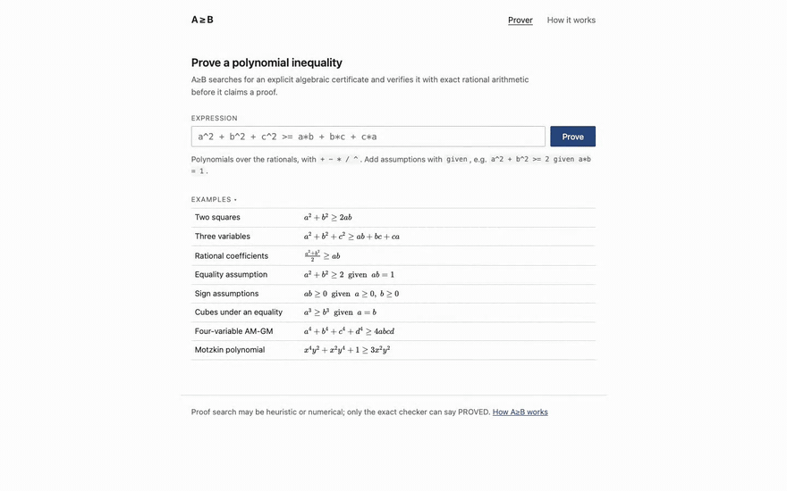

# A≥B (`a-geq-b`)

Checking a polynomial inequality numerically is easy: sample a million
points, watch none of them fail. That is evidence, not proof. Producing a
proof that someone else can verify independently, without trusting your
search code, your solver, or your floating point, is the harder and more
interesting problem.

A≥B proves inequalities by finding an explicit algebraic certificate. For

$$a^2 + b^2 \ge 2ab$$

it returns the rewriting

$$a^2 + b^2 - 2ab = (a-b)^2$$

The right side is visibly nonnegative, so the inequality holds everywhere.
A certificate like this is small enough to inspect by eye and simple enough
for a small exact checker to verify mechanically. That checker is the whole
trust story: search may be heuristic or numerical and is allowed to be
wrong, because nothing is reported `PROVED` until the exact checker accepts
the certificate. A bug in search can lose a proof; it cannot invent one.

## Demo

[](docs/demo/aeqb-demo.mp4)

**[Full walkthrough (mp4, 45 s)](docs/demo/aeqb-demo.mp4):** prove an
inequality, read the typeset certificate, follow the proof path with its
trust tags, and watch a hard target go through the numerical SDP route and
come back exact. Reproducible with `./scripts/readme-media.sh`; nothing in
it is mocked.

## Try it

Build (OCaml + Dune, `opam install zarith yojson alcotest`; zarith needs
GMP, on macOS `brew install gmp`):

```
dune build
dune exec a-geq-b-web        # then open http://127.0.0.1:8642
```

Type an inequality and press Prove; assumptions go after `given`, e.g.
`a^2 + b^2 >= 2 given a*b = 1`. Every result offers "How was this proved?"
(the route actually taken, stage by stage), certificate details (LaTeX and
the JSON file `a-geq-b check` re-verifies), and Lean export. The
"How it works" page walks the architecture.

The same prover on the command line:

```
dune exec a-geq-b -- prove "a^2 + b^2 + c^2 >= a*b + b*c + c*a"
dune exec a-geq-b -- prove "a^2 + b^2 >= 2 given a*b = 1"
dune exec a-geq-b -- check examples/hello_world.cert.json
dune exec a-geq-b -- lean "a^2 + b^2 >= 2*a*b"
```

Statuses (also the exit codes): `PROVED` (0), `NO_CERT_FOUND` (2),
`INVALID_INPUT` (3), `CHECK_FAILED` (4).

## Why certificates

A sum-of-squares certificate for a claim $A \ge B$ is an exact identity

$$A - B = \sum_i c_i\,q_i^2, \qquad c_i \in \mathbb{Q}_{\ge 0}$$

If it holds, the right side is nonnegative at every real point, so the
inequality is proved; and whether it holds is decided by polynomial
expansion and comparison over exact rationals. That comparison is the
entire trusted surface of the system.

This separation is the engineering core of the project. Finding a
decomposition can involve Gram matrices, bounded grid searches,
Positivstellensatz strategies, and an off-the-shelf numerical solver. None
of that is trusted:

```
UNTRUSTED SEARCH

  exact Gram search (rational LDL^T over candidate bases)
  constrained Positivstellensatz strategies
  numerical SDP in Python (cvxpy, floating point)

  ------------- certificate boundary -------------

TRUSTED CORE

  canonical polynomial arithmetic over exact rationals
  the certificate checker (sole authority on PROVED)
```

The Python solver can return a bad matrix without compromising soundness:
its output still has to be reconstructed over the rationals and accepted by
the OCaml checker before anything is called proved.

## What it supports

- Unconstrained polynomial inequalities over the rationals, proved by exact
  sum-of-squares certificates. Division is allowed in the input;
  denominators are cleared soundly.
- Constrained inequalities via `given`, proved by Positivstellensatz
  certificates

  $$p = \sigma_0 + \sum_i \sigma_i\,g_i + \sum_j \lambda_j\,h_j$$

  with sums of squares $\sigma_i$ scaling hypotheses $g_i \ge 0$ and
  arbitrary multipliers $\lambda_j$ on hypotheses $h_j = 0$. The search
  covers constant multipliers, polynomial multipliers on equalities (found
  by reduction), and products of two nonnegative hypotheses.
- Targets whose Gram matrix has more freedom than the exact search
  resolves are closed by the numerical route below.

`NO_CERT_FOUND` is never a disproof. It can mean the claim is false, or
true but not a sum of squares (Motzkin's polynomial is the classic case),
or provable only by a certificate outside the implemented searches. A≥B
never concludes "false".

## The numerical SDP route

Finding a sum-of-squares decomposition is in general a semidefinite
feasibility problem. When exact search comes up empty, A≥B emits the Gram
program as JSON, lets cvxpy find an approximate positive semidefinite
matrix, rounds it back to exact rationals, reads off the squares by
LDL^T, and hands the result to the same trusted checker. The float matrix
only guides the search; the certificate that gets accepted is exact.

```
python3 -m venv .venv && .venv/bin/python -m pip install -r sdp/requirements.txt
.venv/bin/python sdp/prove.py "a^4 + b^4 + c^4 + d^4 >= 4*a*b*c*d"   # -> PROVED
```

The web server picks up the same virtualenv automatically, so the SDP route
works from the browser. With it, all 63 in-scope sum-of-squares corpus
targets are proved (`corpus/run_sdp.py`); the exact search alone closes 53
of them. See [sdp/README.md](sdp/README.md).

## Lean

Two different things are machine-checked in Lean 4 / Mathlib:

- The checker's soundness is proved:
  [lean/AeqbCheck.lean](lean/AeqbCheck.lean) re-expresses the check over
  `MvPolynomial (Fin n) ℚ` and proves, without `sorry`, that an accepted
  certificate implies the target is nonnegative at every real point.
- Each individual proof can be exported as a self-contained Lean theorem
  (`a-geq-b lean`, or the button in the web UI), closed by `ring` and
  `positivity`. Lean's kernel checks it when you compile the file; A≥B does
  not run Lean itself and never claims a kernel check it did not do.

See [lean/README.md](lean/README.md).

## Testing

- `dune runtest`: 141 cases across eight suites covering polynomial
  arithmetic laws and canonicalization, the parser, the checker against
  adversarial certificates (negative weights, wrong expansions, missing and
  extra terms, undeclared hypotheses), prover soundness on false and
  out-of-scope targets, the constrained strategies, Lean export, SDP
  rounding, the structured pipeline record, and the syntactic LaTeX layer.
  One test hands the pipeline a deliberately wrong numerical Gram matrix
  and asserts it cannot end in `PROVED`.
- `cd web/e2e && npx playwright test`: 14 browser tests against the real
  server, asserting proof semantics, honest failure states, trace accuracy,
  typeset content (via the LaTeX each block carries), and Lean-export
  honesty.
- `python3 corpus/verify.py` machine-verifies the 60 stored certificates in
  the [corpus](corpus/README.md) of 119 tagged inequalities;
  `corpus/sanity_sample.py` numerically samples all 119 on their domains
  (sampling is a sanity check, never proof); `corpus/run_prover.py`
  enforces that no false, constrained, or non-SOS entry is ever proved.

## Architecture

Three languages, one trust story: OCaml for everything exact (algebra,
parser, certificates, the trusted checker, search orchestration, both
interfaces), Python for untrusted numerics only, Lean for the formal layer.

```
lib/       Rational, Monomial, Polynomial, Parser, Normalizer, Certificate,
           Constrained, Checker (trusted), Prover, Sdp, Proof_result
bin/       the a-geq-b CLI
web/       a-geq-b-web local server, static UI (KaTeX-typeset), browser
           tests, demo recording
sdp/       Python numerical SDP solver (untrusted)
lean/      verified checker soundness + exported proofs
corpus/    119 tagged inequalities and verification tooling
test/      OCaml test suites
doc/       technical report (LaTeX source and PDF)
examples/  certificate files, valid and deliberately corrupted
```

The invariant behind the checker: polynomials are maps from canonical
monomials (exponent vectors, trailing zeros stripped) to nonzero rational
coefficients, so certificate verification is structural equality of exact
normal forms.

## Technical report

The mathematics (the Gram reformulation, exact rational LDL^T, Newton
polytopes, denominator clearing, the Positivstellensatz fragment, SDP
rounding) and the system design are written up in
[doc/aeqb-design.pdf](doc/aeqb-design.pdf)
(source [doc/aeqb-design.tex](doc/aeqb-design.tex), built with
`tectonic doc/aeqb-design.tex`).

## Limitations

- Sum-of-squares is sufficient, not necessary: some true inequalities have
  no such certificate, and A≥B reports `NO_CERT_FOUND` on them.
- The constrained search does not yet cover products of three or more
  hypotheses or non-constant SOS multipliers on nonnegative hypotheses;
  the checker already accepts those certificate shapes.
- The SDP route uses the full half-degree monomial basis; a Newton polytope
  reduction would shrink the programs.
- The web server is a deliberately small localhost tool, not a network
  service.
